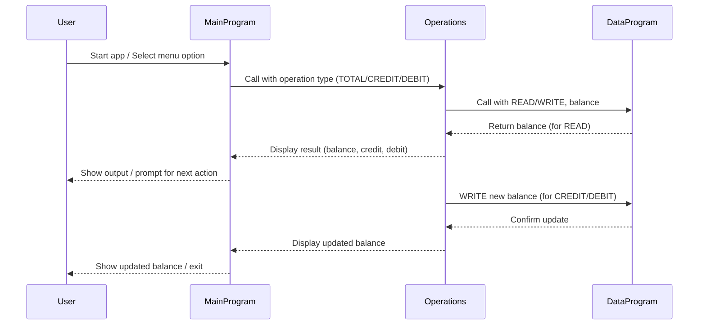

# COBOL Student Account Management System Documentation

This project demonstrates a simple student account management system using COBOL. The system allows users to view balances, credit accounts, and debit accounts, with business rules enforced for student accounts.

## Purpose of Each COBOL File

### main.cob
- **Purpose:** Entry point for the application. Handles user interaction and menu navigation.
- **Key Functions:**
  - Displays menu options: View Balance, Credit Account, Debit Account, Exit.
  - Accepts user input and calls the appropriate operation via the `Operations` program.
- **Business Rules:**
  - Only allows valid choices (1-4).
  - Exits gracefully when the user selects Exit.

### operations.cob
- **Purpose:** Implements the core account operations (view, credit, debit).
- **Key Functions:**
  - Receives operation type from `main.cob`.
  - For 'TOTAL', reads and displays the current balance.
  - For 'CREDIT', accepts an amount, adds it to the balance, and updates storage.
  - For 'DEBIT', accepts an amount, checks for sufficient funds, subtracts from balance if possible, and updates storage.
- **Business Rules:**
  - Debit operation checks for sufficient funds before allowing withdrawal.
  - Credit and debit operations update the balance via the `DataProgram`.

### data.cob
- **Purpose:** Manages persistent storage of the account balance.
- **Key Functions:**
  - For 'READ', returns the current stored balance.
  - For 'WRITE', updates the stored balance with the new value.
- **Business Rules:**
  - Ensures the balance is accurately read and written for each operation.

## Specific Business Rules Related to Student Accounts
- **Initial Balance:** Accounts start with a balance of 1000.00.
- **Debit Operation:** Cannot debit more than the available balance; displays an error if funds are insufficient.
- **Credit Operation:** Any positive amount can be credited to the account.
- **Balance Inquiry:** Always shows the most up-to-date balance.

---

## Sequence Diagram: Data Flow

---

For further details, see the source files in `/src/cobol/`.
